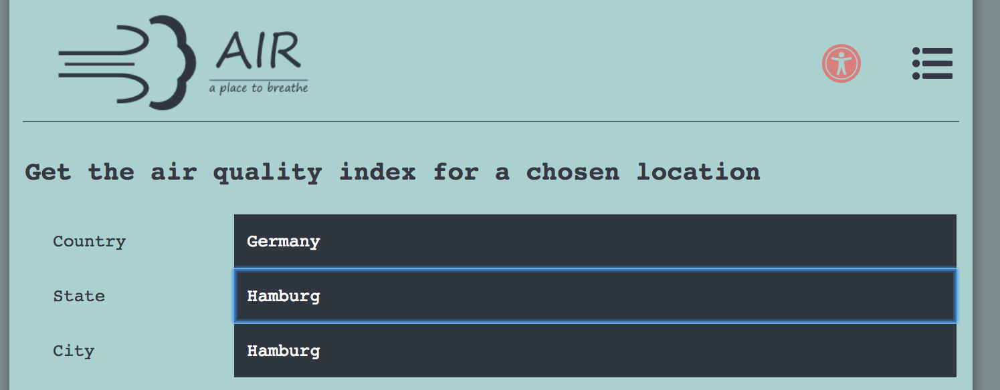
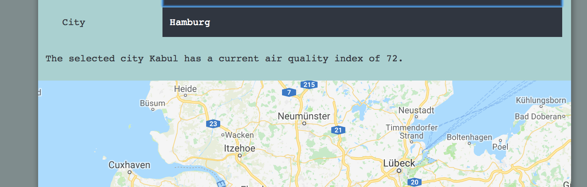
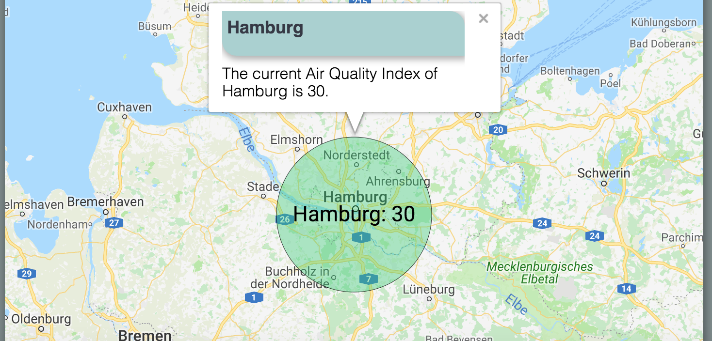

# AIR.IO
AIR - a place to breathe is an air quality application. The main goal is to present the current air quality index of a chosen city. By selecting the country, state and city the query is defined to access the airvisual api. That output will be displayed on a map which will be provided by the google maps api. The air quality index is represented by a number and a color. A higher number, or index, indicates that the air pollution will be of more significance. The same principle goes for the color. A green color indicates a good air quality, a red color a more dangerously one.

## Screenshots
City Selection:

Displaying the air quality index for disabled users:

Displaying the air quality index on map:

## Built With
- HTML 
- CSS
- JavaScript
- jQuery

## Demo
- [Live Demo](https://r1k17.github.io/AIR.io/)

## Author
Tarik Mey

