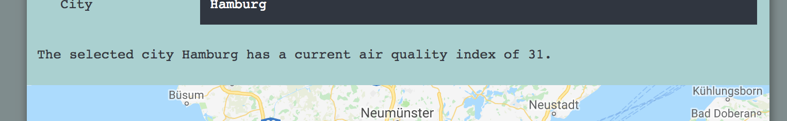

# AIR.IO
AIR - a place to breathe is an air quality application. The main goal is to present the current air quality index of a chosen city. By selecting the country, state and city the query is defined to access the airvisual api. That output will be displayed on a map which will be provided by the google maps api. The air quality index is represented by a number and a color. A higher number, or index, indicates that the air pollution will be of more significance. The same principle goes for the color. A green color indicates a good air quality, a red color a more dangerously one.

## Motivation

## Screenshots
City Selection:

Displaying the air quality index:

Displaying the air quality index for disabled users:

## Environment Setup
## Running the tests
## Built With

## Features
## Demo
- [Live Demo](https://r1k17.github.io/AIR.io/)

* 		The name of your app at the top of the file
* 		A link to your live app
* 		Screenshot(s) of your app. This makes your app description much easier to understand.
* 		A summary section. This should have a concise explanation of what your app does. Try to frame this from the standpoint of what the user does, or what the app enables for the user.
* 		A section on the technology used. For your capstone, this is fairly simple (HTML/CSS/JavaScript/jQuery) but it's still good to list out the key technologies.

